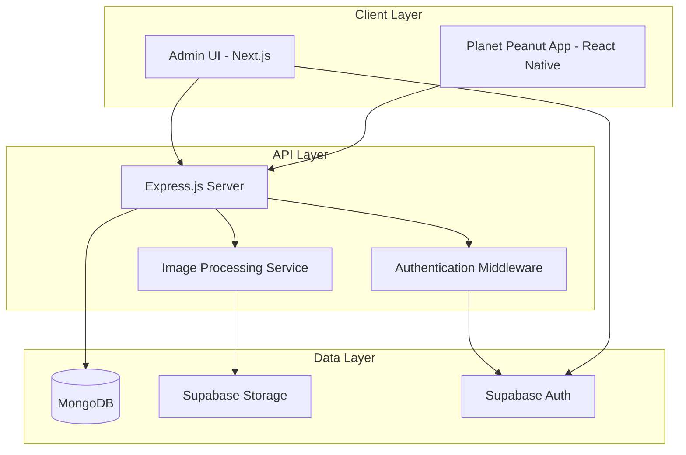
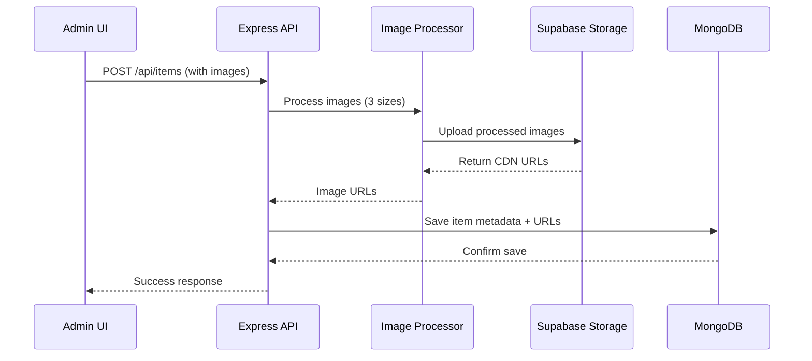
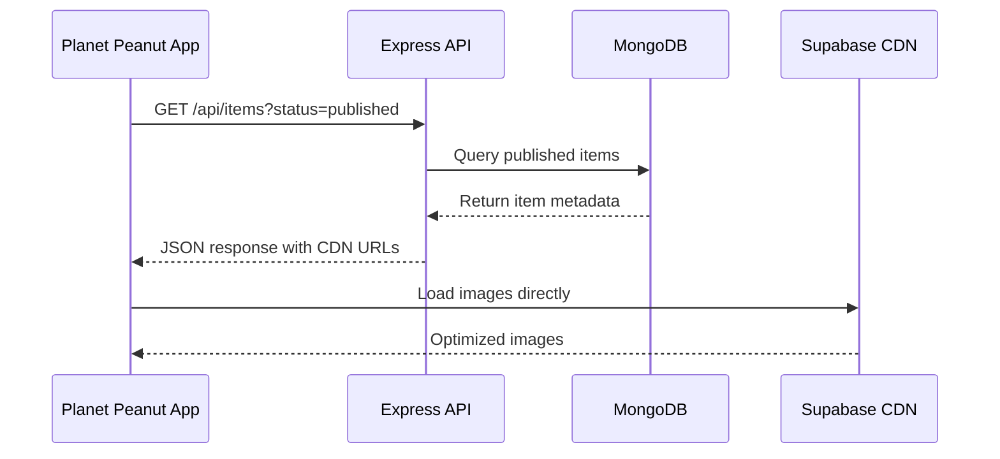

# Technical Architecture

## System Overview

The Planet Peanut CMS is built as a modern three-tier web application with clear separation of concerns:

- **Presentation Layer**: Next.js admin interface
- **Application Layer**: Express.js REST API
- **Data Layer**: MongoDB + Supabase Storage

## Architecture Diagram



## Component Architecture

### Express.js API Server

**Purpose**: Central API hub handling all business logic and data operations

**Key Responsibilities**:
- Route handling and request validation
- Business logic execution
- Database operations via Mongoose
- Image processing coordination
- Authentication and authorization
- Error handling and logging

**Structure**:
```
src/
├── controllers/        # Request handlers
│   ├── itemController.js
│   ├── authController.js
│   └── imageController.js
├── middleware/         # Custom middleware
│   ├── auth.js
│   ├── validation.js
│   └── errorHandler.js
├── models/            # Mongoose schemas
│   └── Item.js
├── routes/            # Route definitions
│   ├── items.js
│   ├── auth.js
│   └── upload.js
├── services/          # Business logic
│   ├── imageService.js
│   ├── supabaseService.js
│   └── itemService.js
└── utils/             # Helper functions
    ├── logger.js
    └── constants.js
```

### Next.js Admin Interface

**Purpose**: Web-based administrative interface for content management

**Key Responsibilities**:
- Item creation and editing forms
- Image upload and preview
- Live avatar preview system
- User authentication interface
- Dashboard and analytics views

**Structure**:
```
admin/
├── pages/
│   ├── api/           # Next.js API routes (proxy to Express)
│   ├── auth/          # Authentication pages
│   ├── items/         # Item management pages
│   └── dashboard/     # Dashboard and overview
├── components/
│   ├── forms/         # Form components
│   ├── ui/           # Reusable UI components
│   ├── layout/       # Layout components
│   └── preview/      # Avatar preview system
├── hooks/            # Custom React hooks
├── utils/            # Helper functions
└── styles/           # Tailwind CSS styles
```

### MongoDB Data Layer

**Purpose**: Primary data store for all item metadata and system data

**Collections**:
- `items`: Avatar items and accessories
- `users`: Admin user accounts (if not using Supabase exclusively)
- `logs`: System audit logs

**Connection Pattern**:
- Single connection pool
- Mongoose ODM for schema validation
- Connection retry logic for resilience

### Supabase Integration

**Storage**:
- Public bucket for item images
- Automatic CDN distribution
- Multiple image sizes per item

**Authentication**:
- JWT-based authentication
- Role-based access control
- Session management

## Data Flow Patterns

### Item Creation Flow



### Mobile App Data Retrieval



## Security Architecture

### Authentication Flow

1. **Admin Login**: Supabase Auth handles login/signup
2. **JWT Issuance**: Supabase issues JWT tokens
3. **API Protection**: Express middleware validates JWTs
4. **Role Checking**: Middleware checks user roles/permissions

### API Security Layers

```javascript
// Security middleware stack
app.use(helmet());              // Security headers
app.use(cors(corsOptions));     // CORS protection
app.use(rateLimiter);          // Rate limiting
app.use(validateJWT);          // JWT validation
app.use(checkPermissions);     // Role-based access
```

### Data Validation

- **Input Validation**: Joi schemas for all endpoints
- **File Validation**: MIME type and size checking
- **Output Sanitization**: Prevent XSS in responses

## Performance Optimizations

### Database Optimizations

```javascript
// MongoDB indexes for common queries
ItemSchema.index({ status: 1, releaseDate: -1 });
ItemSchema.index({ tags: 1, currency: 1 });
ItemSchema.index({ level: 1, clothingType: 1 });
```

### Image Processing Strategy

- **Sharp.js**: Fast, memory-efficient image processing
- **Multiple Sizes**: Generate 3 sizes during upload
- **WebP Support**: Optional WebP generation for smaller files
- **Background Processing**: Queue-based processing for bulk uploads

### Caching Strategy

- **CDN Caching**: Supabase CDN caches images globally
- **API Caching**: Redis cache for frequently accessed data
- **Browser Caching**: Proper cache headers for static assets

## Scalability Considerations

### Horizontal Scaling

- **Stateless API**: No server-side sessions
- **Load Balancing**: Multiple API instances behind load balancer
- **Database Sharding**: Partition data by release date or category

### Vertical Scaling

- **Connection Pooling**: Optimize database connections
- **Memory Management**: Efficient image processing
- **CPU Optimization**: Async/await patterns throughout

## Monitoring and Observability

### Logging Strategy

```javascript
// Winston logger configuration
const logger = winston.createLogger({
  level: process.env.LOG_LEVEL || 'info',
  format: winston.format.combine(
    winston.format.timestamp(),
    winston.format.errors({ stack: true }),
    winston.format.json()
  ),
  transports: [
    new winston.transports.File({ filename: 'logs/error.log', level: 'error' }),
    new winston.transports.File({ filename: 'logs/combined.log' })
  ]
});
```

### Health Checks

- **API Health**: `/health` endpoint with dependency checks
- **Database Health**: MongoDB connection status
- **Storage Health**: Supabase Storage connectivity

### Metrics Collection

- **API Metrics**: Request counts, response times, error rates
- **Business Metrics**: Items created, images processed, API usage
- **Infrastructure Metrics**: Database performance, storage usage

## Error Handling Strategy

### API Error Responses

```javascript
// Standardized error response format
{
  "success": false,
  "error": {
    "code": "VALIDATION_ERROR",
    "message": "Item title is required",
    "details": {
      "field": "title",
      "value": null
    }
  },
  "timestamp": "2024-01-15T10:30:00.000Z",
  "requestId": "req_abc123"
}
```

### Error Categories

- **Validation Errors**: 400 - Bad Request
- **Authentication Errors**: 401 - Unauthorized  
- **Authorization Errors**: 403 - Forbidden
- **Not Found Errors**: 404 - Not Found
- **Server Errors**: 500 - Internal Server Error

This architecture provides a solid foundation for building a scalable, maintainable CMS system that can grow with your Planet Peanut application needs.